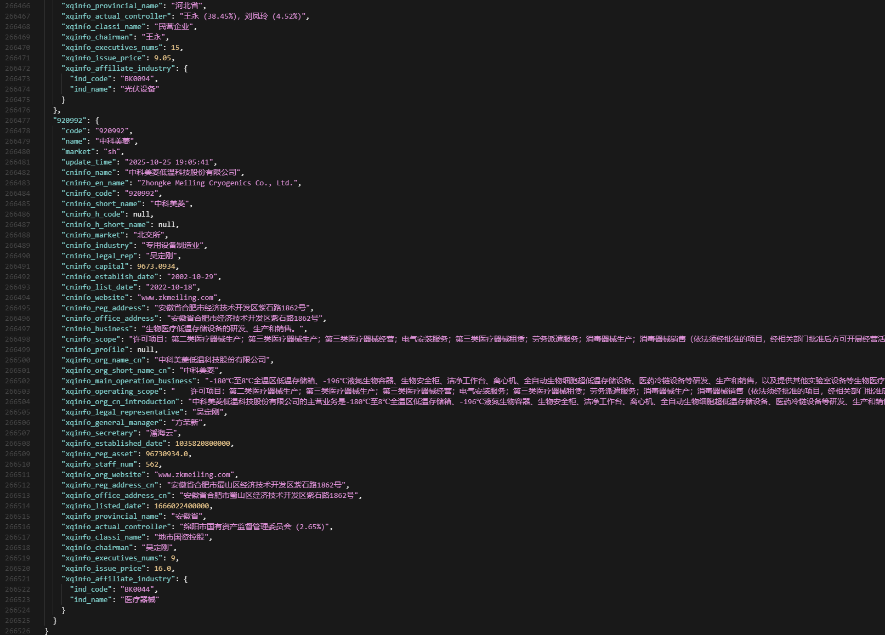
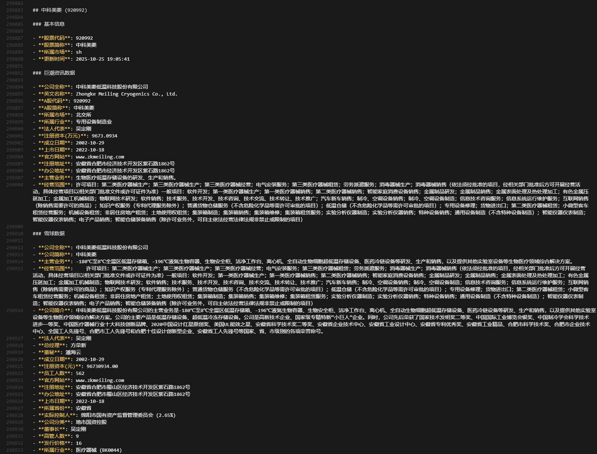

# 股票基础信息获取项目

## 📋 项目概述

本项目是一个基于AkShare的股票基础信息批量获取工具，支持从多个数据源（巨潮资讯、雪球）批量获取A股股票的基础信息，并将结果保存为JSON和Markdown两种格式，方便数据分析和展示。

## 📊 输出文件说明

项目运行后会生成两个重要的输出文件：

### 1. stock_base_info.json

JSON格式的股票基础信息数据库，包含所有A股股票的详细基础信息。这是项目的主要数据输出文件，以结构化的方式存储了每只股票的基本信息、巨潮资讯数据和雪球数据。

**文件示例：**


**主要特点：**
- 完整的股票基础信息（代码、名称、市场）
- 巨潮资讯(cninfo)的17个字段数据
- 雪球(xqinfo)的21个字段数据
- 时间戳记录每次数据更新时间
- 便于程序化处理和数据分析

### 2. ./data/stock_base_info.md

Markdown格式的股票基础信息文档，将JSON数据转换为可读性更强的Markdown格式，适合人类阅读和展示。

**文件示例：**


**主要特点：**
- 格式化的中文字段显示
- 分组展示（基本信息、巨潮资讯数据、雪球数据）
- 便于阅读和分享
- 支持Markdown渲染工具
- 可用作AI知识库进行问答

## 🏗️ 项目结构

```
stock_base_info/
├── README.md                      # 项目说明文档
├── requirements.txt               # Python依赖包
├── stock_base_info.json          # 输出：JSON格式数据
├── stock_progress_checkpoint.json # 断点续传文件
│
├── stock_code_name.py            # 获取A股股票代码列表
├── stock_base_cninfo.py          # 从巨潮资讯获取股票信息
├── stock_base_xqinfo.py          # 从雪球获取股票信息
├── stock_base_handle.py          # 统一数据获取接口
├── stock_base_multi_handle.py    # 批量数据获取（支持断点续传）
├── stock_base_json_2_md.py       # JSON转Markdown工具
├── test.py                        # 接口测试脚本
│
├── data/                          # 数据输出目录
│   ├── stock_base_info.md         # 输出：Markdown格式数据
│   └── 字段说明.md                # 字段说明文档
│
├── docs/                          # 文档目录
│   ├── 基础信息获取方法.md        # 接口使用说明
│   ├── stock_README.md          # AkShare stock模块说明
│   ├── stock_a_README.md        # AkShare stock_a模块说明
│   ├── stock_feature_README.md  # AkShare feature模块说明
│   └── stock_fundamental_README.md  # AkShare基本面模块说明
│
└── output/                        # 临时输出目录
    ├── stock_base_cninfo_output.txt
    ├── stock_base_cninfo_en_output.txt
    └── stock_base_xqinfo_output.txt
```

## 🚀 快速开始

### 1. 环境要求

- Python 3.8+
- pip

### 2. 安装依赖

```bash
pip install -r requirements.txt
```

### 3. 测试运行

先运行测试模式，获取前10+后10只股票的信息：

```bash
python stock_base_multi_handle.py test
```

### 4. 完整运行

获取所有A股股票的基础信息（生成stock_base_info.json文件）：

```bash
python stock_base_multi_handle.py
```

### 5. 生成生成stock_base_info.md文件


```bash
python stock_base_json_2_md.py
```

## 📝 核心功能

### 1. 股票代码和名称获取 (`stock_code_name.py`)

- 获取所有A股股票代码和名称
- 支持JSON格式输出
- 自动识别所属市场（上交所/深交所/北交所）

```python
from stock_code_name import stock_info_a_code_name_json

# 获取所有A股股票代码和名称
stock_codes = stock_info_a_code_name_json()
print(f"共获取 {len(stock_codes)} 只股票")
```

### 2. 巨潮资讯数据获取 (`stock_base_cninfo.py`)

从巨潮资讯获取股票基础信息，包含17个字段：
- 公司名称、英文名称
- A股/H股代码和简称
- 所属市场、所属行业
- 法人代表、注册资本
- 成立日期、上市日期
- 官方网站、注册地址、办公地址
- 主营业务、经营范围、公司简介

```python
from stock_base_cninfo import get_stock_basic_info

# 获取中信证券的基础信息
cn_info, en_info = get_stock_basic_info("600030")
```

### 3. 雪球数据获取 (`stock_base_xqinfo.py`)

从雪球获取股票详细信息，包含21个字段：
- 公司全称和简称
- 主营业务、经营范围、公司简介
- 法人代表、总经理、董秘
- 成立日期、注册资本、员工人数
- 官方网站、注册地址、办公地址
- 上市日期、所属省份、实际控制人
- 公司分类、董事长、高管人数
- 发行价格、所属行业

```python
from stock_base_xqinfo import get_xueqiu_stock_info

# 获取中信证券的雪球信息
xq_info = get_xueqiu_stock_info("600030")
```

### 4. 统一数据获取接口 (`stock_base_handle.py`)

整合cninfo和xqinfo两个数据源，提供统一的获取接口：

```python
from stock_base_handle import get_stock_info

# 获取股票的综合信息（包含cninfo和xqinfo）
stock_data = get_stock_info("600030")
```

### 5. 批量数据获取 (`stock_base_multi_handle.py`)

**核心特性：**
- ✅ 批量获取所有A股股票信息
- ✅ 智能延迟控制，避免API封禁
- ✅ 断点续传功能，支持中断后继续
- ✅ 自动重试机制（最多3次）
- ✅ 实时进度显示
- ✅ 错误处理和状态记录

**运行方式：**

```bash
# 完整模式：获取所有股票
python stock_base_multi_handle.py

# 测试模式：获取前10+后10只股票
python stock_base_multi_handle.py test

# 清理断点文件
python stock_base_multi_handle.py clear

# 显示帮助信息
python stock_base_multi_handle.py help
```

### 6. JSON转Markdown (`stock_base_json_2_md.py`)

将JSON格式的股票信息转换为Markdown格式：

```bash
python stock_base_json_2_md.py
```

## 📊 数据字段说明

详细字段说明请查看：[字段说明文档](data/字段说明.md)

### 基本字段
- `code`: 股票代码（6位数字）
- `name`: 股票简称
- `market`: 所属市场（sz=深交所，sh=上交所，bj=北交所）
- `update_time`: 数据更新时间

### cninfo字段（17个）
以`cninfo_`开头，来自巨潮资讯数据源。

### xqinfo字段（21个）
以`xqinfo_`开头，来自雪球数据源。

## ⚙️ 配置说明

### 请求参数配置

在`stock_base_multi_handle.py`中可以修改以下参数：

```python
# 批次大小：每处理多少只股票显示一次进度
batch_size = 10

# 延迟时间：每次请求之间的延迟（秒）
delay = 2.0  # 增加延迟可降低封禁风险

# 测试模式：只获取前10+后10只股票
test_mode = True
```

### 安全特性

1. **智能延迟控制**
   - 基础延迟：2秒/股票
   - 错误时自动增加延迟
   - 成功时逐渐恢复延迟

2. **自动重试机制**
   - 最多重试3次
   - 网络错误时增加等待时间
   - 重试间隔动态调整

3. **断点续传**
   - 自动保存处理进度
   - 支持中断后继续
   - 跳过已处理的股票

## 📚 相关文档

- [字段说明文档](data/字段说明.md)
- [基础信息获取方法](docs/基础信息获取方法.md)
- [AkShare Stock模块说明](docs/stock_README.md)
- [AkShare Stock_A模块说明](docs/stock_a_README.md)
- [AkShare Feature模块说明](docs/stock_feature_README.md)
- [AkShare Fundamental模块说明](docs/stock_fundamental_README.md)

## 🤝 贡献指南

欢迎提交Issue和Pull Request！

## ⭐ 致谢

- [AkShare](https://github.com/akfamily/akshare) - 提供数据获取支持
- 巨潮资讯 - 提供权威股票基础信息
- 雪球 - 提供详细股票数据
